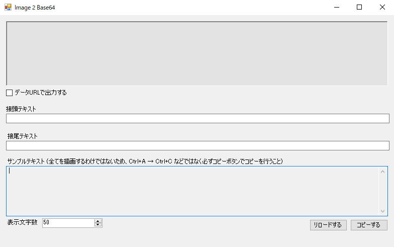

# Image 2 Base64

## Appearance / 外観

## How To Use / 使い方
至ってシンプル．

* 上部の窪んでいるように見えるパネル内に，画像をドラッグ・アンド・ドロップするだけで自動的にBase64文字列が生成される．**その結果の一部**は下部の「サンプルテキスト」テキストボックスに出力される．
  * 注意書きしてあるように，文字列のコピーには後述のコピーボタンを使用すること．
  * 対応している画像の拡張子はpng, bmp, jpegのみで，それ以外は変換可能であればjpegになる（一部の表記ゆれにも対応，詳細は[ソースコード](https://github.com/PhantomquartzPark/Image2Base64/blob/main/Image2Base64/Form1.cs)を参照のこと）
* 「コピーする」ボタンを押下することで，そのテキストをクリップボードにコピーする．
* 「リロードする」ボタンを押下することで，「接頭テキスト」「接尾テキスト」「データURL化の指定」を考慮し，文字列の再構成が行われる．
  * 「データURL化の指定」に対するチェックと，「接頭テキスト」の`!`指定は，Jupyter Notebookへの埋め込みなどに有効
  * 「接尾テキスト」の有効性は現状不明
